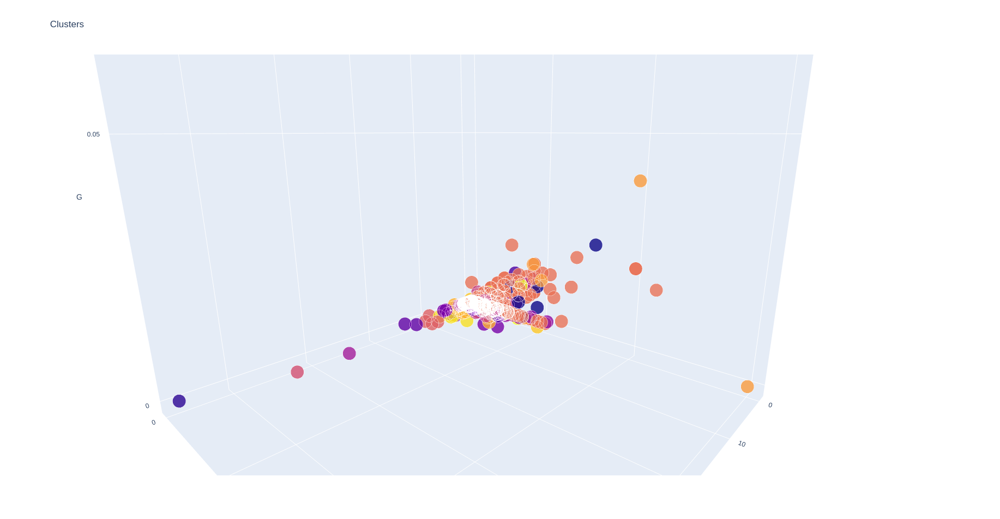

# Aprendizado não supervisionado.

## Introdução

O aprendizado não supervisionado é uma abordagem fundamental na análise de dados, permitindo que algoritmos identifiquem padrões e estruturas em conjuntos de dados sem a necessidade de rótulos ou supervisão externa. Neste experimento, exploramos duas técnicas populares de aprendizado não supervisionado: o algoritmo K-means e a rede neural auto-organizável MiniSOM (Mini Self-Organizing Map). Configuramos o K-means com 18 clusters e o MiniSOM com 18 neurônios, buscando compreender e comparar suas capacidades de agrupamento e organização dos dados. Este estudo visa não apenas explorar as características intrínsecas dos algoritmos, mas também analisar a eficácia de suas configurações em um contexto específico de análise de dados.

## Agrupamentos

### Plot 3D

Para compreender a distribuição dos dados, realizamos uma análise em três dimensões. Na Figura 1, onde aplicamos o algoritmo K-means, observamos que os clusters próximos exibem uma heterogeneidade significativa, indicando uma diversidade de padrões próximos uns aos outros. Em contraste, na Figura 2, utilizando o algoritmo MiniSOM, notamos que os dados próximos tendem a pertencer ao mesmo cluster, sugerindo uma maior coesão e uniformidade nessas regiões. Essa distinção nos padrões de agrupamento entre os dois algoritmos oferece insights valiosos sobre suas características e eficácia na análise dos dados tridimensionais.

​											**Figura 1.** K-means plot 3D. 

​											**Figura 2.** MiniSom plot 3D. 
### Plot 2D
Quando reduzimos a dimensionalidade para duas, observamos o mesmo comportamento nas Figuras 1 e 2, que utilizam o K-means e o MiniSOM, respectivamente.

​											**Figura 3.** K-means plot 2D. 

​											**Figura 4.** Minisom plot 2D. 

### Plot usando SNE

Ao aplicar o t-SNE (t-distributed Stochastic Neighbor Embedding), obtivemos gráficos visualmente semelhantes, porém com divisões de clusters diferentes. Na Figura 5, observamos que o K-means centraliza os clusters, enquanto na Figura 6, o MiniSom divide o centro em múltiplos clusters. Essas discrepâncias evidenciam a sensibilidade dos algoritmos aos métodos de redução de dimensionalidade, fornecendo insights adicionais sobre a estrutura dos dados.

​									**Figura 5.** K-means plot usando redução de dimensionalidade. 

​	

​									**Figura 6.** Minisom plot usando redução de dimensionalidade. 

# Plots dos clusters por países

Aqui podemos observar que a dimensão raised (investimento recebido pela startup) tem uma relação
inversamente proporcional a ESG, ou seja, quanto mais investimentos a startup recebe, menos ela cresce
na dimensão do ESG. Ao analisar a escala ESG, que por sua vez é uma métrica para avaliar aspectos
ambientais, sociais e de governança de empresas, é possível verificar que a maioria das startups tem pelo
menos 0.01 ou mais de pontuação na tal escala. Por outro lado, ao avaliar as startups que mais receberam
investimentos é possível verificar que muitas delas tem um valor abaixo de 0.01 na escala ESG, ou seja,
tais empresas se preocuparam muito pouco com questões como:

    ● Publicação de um relatório de carbono ou sustentabilidade
    ● Operação em cadeias de suprimentos éticas
    ● Aderir a diversidade no conselho de administração
    ● Utilização de fontes de energia renováveis
    ● Oferecimento de segurança no local de trabalho questionável ou empregar trabalho infantil

Aqui temos um gráfico que mostra startups por países e seus respectivos investimentos (raised).

Esta imagem utiliza a técnica t-SNE (t-distributed stochastic neighbor embedding) que é uma técnica
de redução de dimensionalidade, no caso, está redimensionando o primeiro gráfico gerado em 3 dimensões
para um gráfico de 2 dimensões. Esta técnica foi utilizada para representar startups com atributos
semelhantes, ou seja, valores das colunas semelhantes entre si e agrupá-las em clusters. Além disso, a
forma de representação em 2D facilita bastante a visualização dos clusters pelos parâmetros de ESG e
raised. Essa técnica é frequentemente utilizada em visualização de dados, análise exploratória
e pré-processamento de dados para tarefas de aprendizado de máquina.

Aqui podemos observar que a dimensão raised (investimento recebido pela startup) tem uma relação
inversamente proporcional a ESG, ou seja, quanto mais investimentos a startup recebe, menos ela cresce
na dimensão do ESG. Ao analisar a escala ESG, que por sua vez é uma métrica para avaliar aspectos
ambientais, sociais e de governança de empresas, é possível verificar que a maioria das startups tem pelo
menos 0.01 ou mais de pontuação na tal escala. Por outro lado, ao avaliar as startups que mais receberam
investimentos é possível verificar que muitas delas tem um valor abaixo de 0.01 na escala ESG, ou seja,
tais empresas se preocuparam muito pouco com questões como:

    ● Publicação de um relatório de carbono ou sustentabilidade
    ● Operação em cadeias de suprimentos éticas
    ● Aderir a diversidade no conselho de administração
    ● Utilização de fontes de energia renováveis
    ● Oferecimento de segurança no local de trabalho questionável ou empregar trabalho infantil

Aqui temos um gráfico que mostra startups por países e seus respectivos investimentos (raised).

Esta imagem utiliza a técnica t-SNE (t-distributed stochastic neighbor embedding) que é uma técnica
de redução de dimensionalidade, no caso, está redimensionando o primeiro gráfico gerado em 3 dimensões
para um gráfico de 2 dimensões. Esta técnica foi utilizada para representar startups com atributos
semelhantes, ou seja, valores das colunas semelhantes entre si e agrupá-las em clusters. Além disso, a
forma de representação em 2D facilita bastante a visualização dos clusters pelos parâmetros de ESG e
raised. Essa técnica é frequentemente utilizada em visualização de dados, análise exploratória
e pré-processamento de dados para tarefas de aprendizado de máquina.

# Conclusão

Neste experimento, exploramos e comparamos duas técnicas populares de aprendizado não supervisionado: o algoritmo K-means e a rede neural auto-organizável MiniSOM. Observamos que, embora ambos os métodos sejam capazes de identificar padrões nos dados, apresentam diferenças significativas em relação à coesão dos clusters e à sensibilidade às técnicas de redução de dimensionalidade.

O K-means demonstrou uma tendência a criar clusters mais heterogêneos, com uma maior dispersão dos dados próximos. Por outro lado, o MiniSOM exibiu uma maior coesão entre os dados do mesmo cluster, resultando em agrupamentos mais uniformes e compactos.

Além disso, ao aplicar o t-SNE para visualização dos clusters, notamos que os algoritmos reagiram de maneira diferente à redução de dimensionalidade, evidenciando sua sensibilidade a esse aspecto e oferecendo insights valiosos sobre a estrutura dos dados.

Em suma, este estudo ressalta a importância de considerar as características específicas de cada algoritmo de aprendizado não supervisionado ao realizar análises de dados. A escolha entre o K-means e o MiniSOM deve ser feita com base nas propriedades do conjunto de dados e nos objetivos da análise, levando em conta fatores como coesão do cluster, dispersão dos dados e sensibilidade à dimensionalidade.